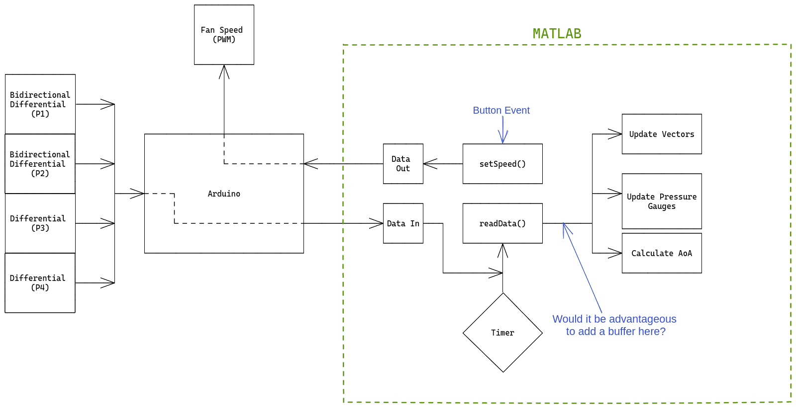

# WindTunnelUX
User interface for desktop wind tunnel.

# Arduino
The microcontroller code is located in the "Arudino" directory. For the sake of documentation, several versions of the program exist. Once a final version is created, it will be indicated by the suffix "-final".

Current version: pwm_with_ams5915_SPEED

Note that you will need to copy the directory Arduino/libs/ams5915 to your Arduino libraries folder. This contains class definitions for the AMS pressure sensors that are used in the Arduino program. This library was originally created by Brian Taylor at Bolder Flight Systems, and slightly modified for this project by James Johnson.

# Source files
The files located in src/ -- perhaps not the greatest name for the directory -- include various Matlab scripts and the Matlab app. Some scripts only exist for feature testing and will be removed later.

# User Interface Architecture


The overall idea is to have a timer in the Matlab GUI that continually updates the GUI after a certain time interval. That update involves reading in data from the Arduino serial port that contains the pressure and the airspeed or angle of attack. This information needs to be sent to the relative GUI components, such as the plots and gauges.

The user also has the ability to select the speed at which the fan will run. This is taken care of by a `setSpeed()` function that is called when the "Set Speed" button is pushed. It queues up a value to write to serial asynchronously.

## Function Descriptions
### readData()
This function reads the data from the Arduino. It does this by reading (4) lines and storing them in an array of strings. These strings are then separated -- based on "Tab" delimiters -- and converted to doubles. The output array looks as follows:
```
2    ######    ######
3    ######    ######
4    ######    ######
1    ######    ######
```
The first number corresponds to the pressure sensor. The second number is the differential pressure in Pa. The final number will be either `0` or the calculated airspeed, depending on the purpose of the sensor.

After updating the vectors with a new data point at the end, the plots are updated using `refreshdata`. See Matlab documentation for more information.

### Timer
The timer is activated when the user clicks the "Connect" button, and it is deleted if the app is closed or the user clicks "Disconnect". When it is started, the selected serial port is also opened.

### Angle of Attack Calculation
Not yet implemented.
